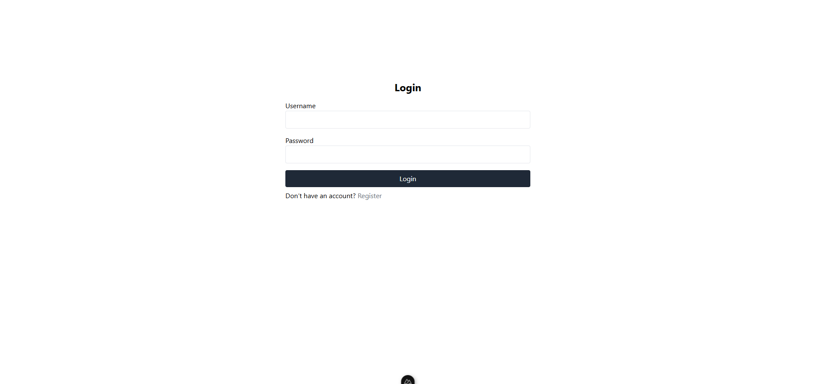
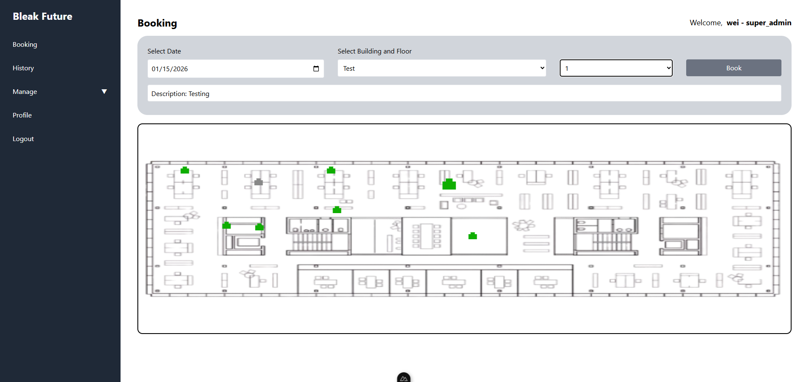
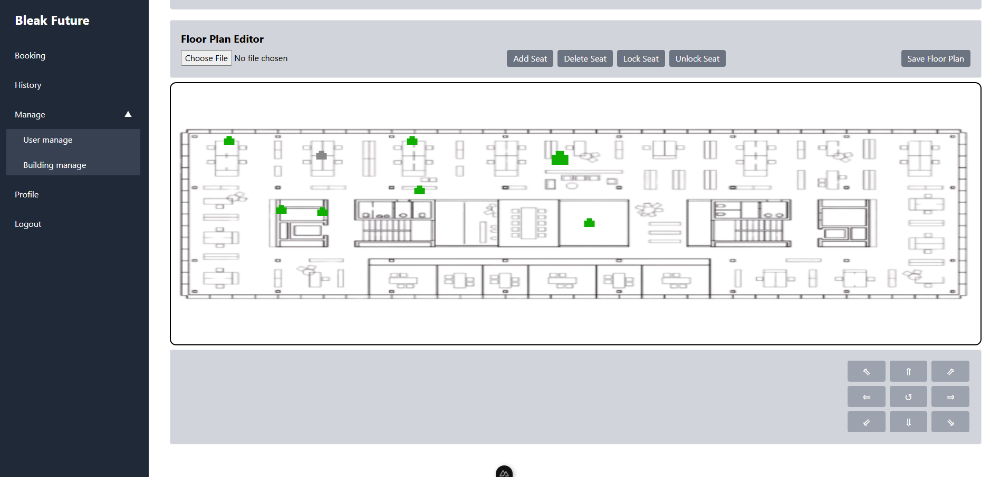

# Workspace Management System

A full-stack seat booking solution built with Nuxt 3 (Vue 3) for the frontend and Node.js + TypeScript for the backend. The project features an interactive floor plan editor for seat layout management, enabling to efficiently manage workspace bookings.

## Features

### Floor Plan & Seat Management
- **Upload Floor Plans**:
  - Support for multiple image formats (PNG, JPG, SVG, etc.)
- **Interactive Floor Plan Editor**:
  - Built with Fabric.js for intuitive drag-and-drop functionality
  - Flexible floor design without hardcoded layouts
- **Visual Seat Positioning**: 
  - Drag, move, and arrange seats directly on the floor plan
  - Real-time preview of seat layouts
  - Canvas-based coordinate system for precise placement
  - Seat scale adjustment for different floor plan sizes
- **Persistent Storage**:
  - Seat layout data serialized and stored in the backend
- **Multi-Building Support**:
  - Manage multiple buildings, floors, and floor plans

### Seat Booking
- **Browse by Location**:
  - View seat layouts organized by building and floor
- **Interactive Seat Selection**:
  - Visual interface for selecting available seats
- **Booking Management**:
  - Create, view, and cancel bookings
- **Booking History**:
  - Track all past and current bookings
- **Real-time Availability**:
  - Check seat availability before booking

### User Management
- **Authentication System**:
  - Secure login and registration
- **Role-Based Access Control**:
  - Support for regular users, admins, and super admins
- **User Profiles**:
  - View and manage personal information
- **Admin Dashboard**:
  - User management interface for administrators

### System Features
- RESTful API backend with Express
- Clean frontend–backend separation
- Responsive layout with Tailwind CSS
- Type-safe development with TypeScript
- State management with Pinia
- Database migrations with Sequelize
- Scalable project structure for future expansion

## Tech Stack
### Frontend
- **Framework**: Nuxt 3 (Vue 3 + Vite)
- **Language**: TypeScript + JavaScript
- **State Management**: Pinia
- **Styling**: Tailwind CSS
- **HTTP Client**: Axios
- **Canvas Editor**: Fabric.js (Floor plan editor)

### Backend
- **Runtime**: Node.js
- **Framework**: Express
- **Language**: TypeScript
- **ORM**: Sequelize
- **Database**: PostgreSQL (configurable for other SQL databases)
- **Authentication**: JWT-based authentication

## Prerequisites
````
Node.js >= 18 

npm 

PostgreSQL (for backend database) 
````

## Quick Start
**Backend setup (development)**
````
cd backend

npm install

cp .env.example .env   # create and edit .env as needed, refer to backend readme

npm run dev
````

**Frontend setup (development)**
````
cd frontend

npm install

npm run dev

````

## Database Management
### Backend migrations:
````
cd backend
npx sequelize-cli db:migrate
````

### Reverting Migrations: 
````
cd backend
npx sequelize-cli db:migrate:undo
````

### Creating New Migrations: 
```
cd backend
npx sequelize-cli migration:generate --name your-migration-name
```

### Database Connection Issues
- Verify PostgreSQL is running
- Check database credentials in `.env`
- Ensure the database exists: `createdb your_database_name`

### Linting & Formatting

Both backend and frontend include ESLint and Prettier configurations.

**Backend**
````
cd backend
npm run lint
npm run lint:fix
npm run format
````

**Frontend**
````
cd frontend
npm run lint
npm run lint:fix
npm run format
````

## Authentication Flow

Authentication is handled by:
- **Backend**:
  - JWT tokens
- **Frontend**:
  - Pinia store
  - Global middleware

Protected routes automatically redirect unauthenticated users to the login page.

## Useful Notes
- Floor plan images are stored in: backend/public/uploads/floorplans/
- Seat positions are stored as JSON coordinates in the database

## Project Structure
````
BleakFuture/
├── backend/                   # Backend application
│   ├── src/
│   │   ├── index.ts           # Application entry point
│   │   ├── config/            # Configuration files
│   │   ├── controllers/       # Route controllers
│   │   ├── db/		           # Database
│   │   │   ├── dao/           # Data Access Objects
│   │   │   ├── entities/      # Entity definitions
│   │   │   ├── migrations/    # Database migrations
│   │   │   └── models/        # Sequelize models
│   │   ├── middleware/        # Express middleware
│   │   │   └── auth.ts        # Authentication middleware
│   │   └── routes/            # API routes
│   ├── public/
│   │   └── uploads/
│   │       └── floorplans/    # Uploaded floor plan images
│   └── package.json
│
├── frontend/                  # Frontend application
│   ├── components/            # Vue components
│   ├── middleware/		       # middleware
│   ├── pages/                 # Application pages
│   │   └── admin/             # Admin pages
│   ├── services/		       # API service layer
│   ├── stores/                # Pinia stores
│   ├── assets/		           # Assets
│   │   └── css/		       # Global Tailwind CSS
│   ├── nuxt.config.ts         # Nuxt configuration
│   └── package.json
│
└── README.md                  # This file
````

## App screenshot





## This was mainly for practice purposes
````
FaricJs is fine for a simple demos or basic drawing.
But for complex, rule-driven editors, the code will become messy and hard to debug.
Many examples dont match the versions, solution found online offten dont work as expected.

https://fabric5.fabricjs.com/docs/index.html

````
